# VisualizacionDeDatos
En este repositorio se incluirán una serie de Dashboards interactivos elaborados a través de diferentes herramientas de visualización de datos. Haciendo uso de **Microsoft Power BI, Tableau, Apache Superset y Excel** se llevarán a cabo diferentes representaciones de datos. 

## Datasets
Para cada una de las herramientas se ha hecho uso de un conjunto de datos diferente (los csv se han incluido en cada una de las carpetas creadas para las diferentes aplicaciones). Así, todos los datos han sido preprocesados; indicando en el informe de cada práctica los pasos asociados a esta tarea. Para todos los ejercicios, la fuente de datos empleada ha sido  [Kaggle](https://www.kaggle.com/), excepto para Apache Superset que se ha empleado una base de datos PostgreSQL (ver informe).

## Tarea realizada
Las diferentes representaciones hacen referencia a tareas realizadas para las asignaturas de Almacenes y Minería de Datos y Visualización Avanzada. Así, para cada actividad se disponía de un periodo de trabajo de máximo 6 días.

## Microsoft Excel: Producción de vino en California
### Carpeta
DASHBOARDS EXCEL
## Dashboards:

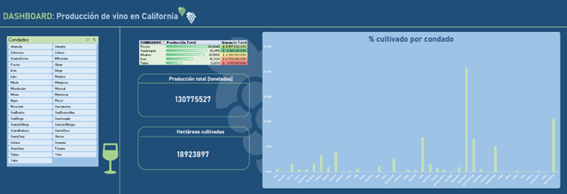
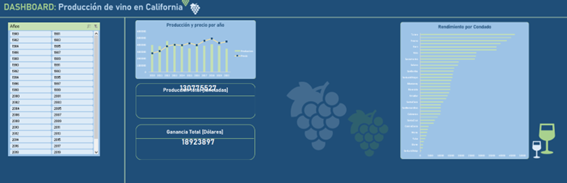

## Microsoft Power BI: Análisis sobre las características de los Pokémon
### Carpeta
DASHBOARDS POWER BI
## Dashboards:

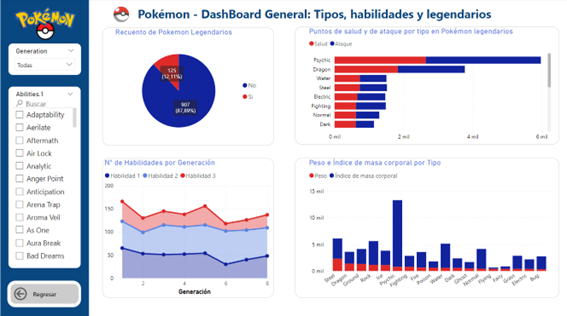
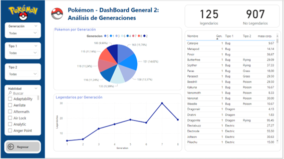
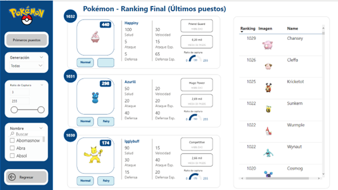

## TABLEAU: TikTok: vídeos populares, autores y estadísticas
### Carpeta
DASHBOARDS TABLEAU
## Dashboards:

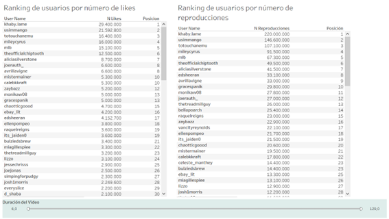
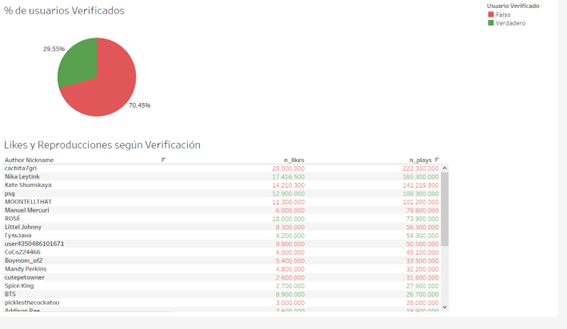
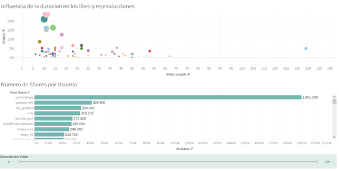

## APACHE SUPERSET: Práctica colaborativa con Pablo Martinez González
### Carpeta
DASHBOARDS SUPERSET
## Dashboards:

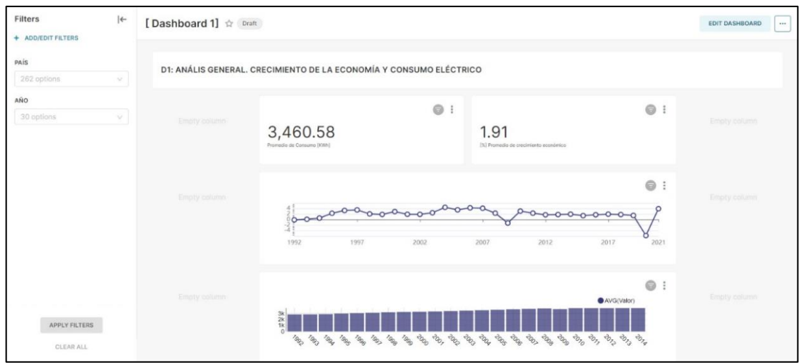
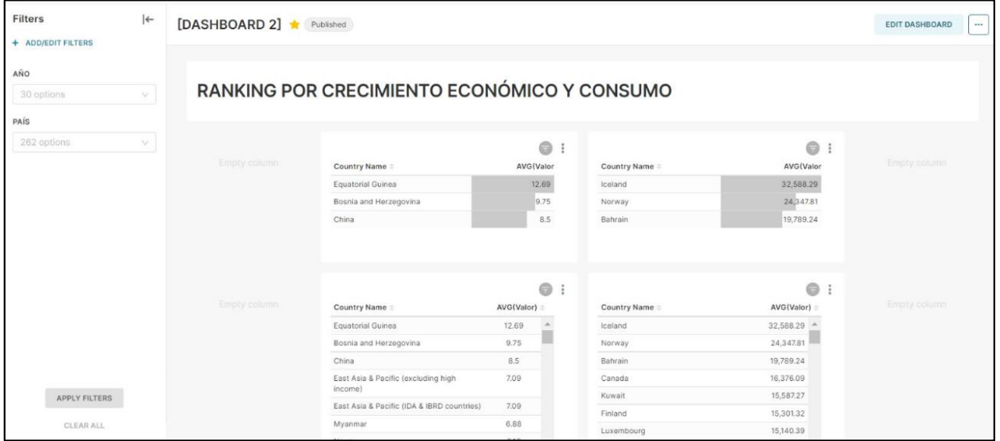
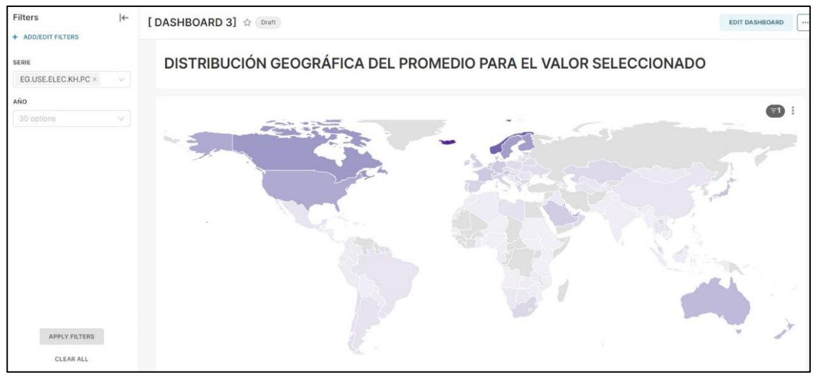
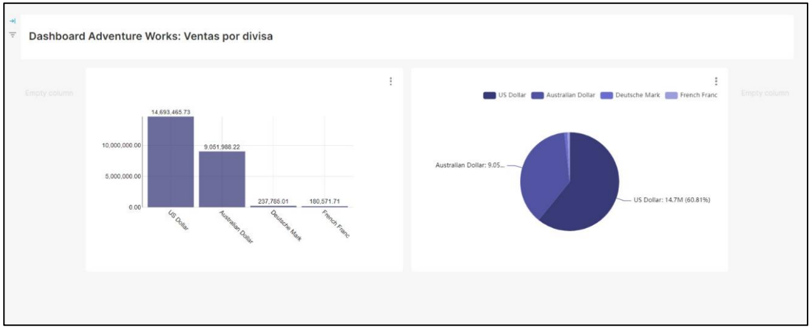
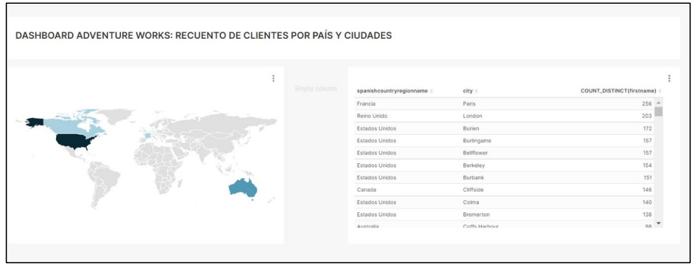
